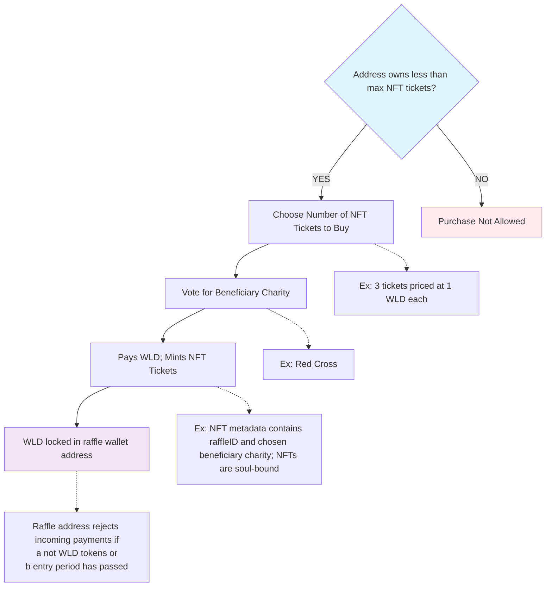
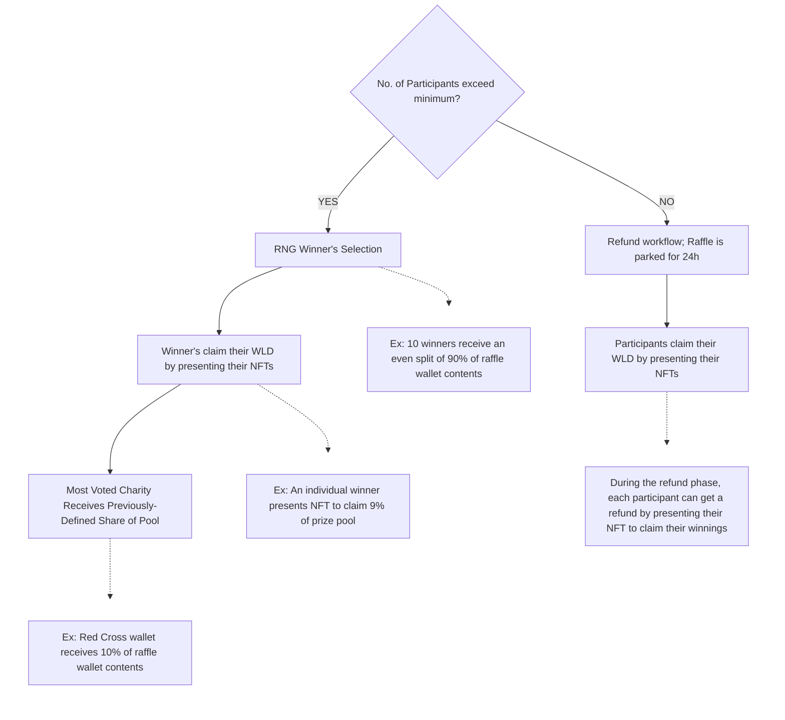

# RAFFLETIME: WorldID-Powered Zero-Loss On-Chain Sweepstakes Protocol

CONCEPT BRIEF  
LB/20250907

## Leverage WorldID to create a provably fair, zero-loss, generalized sweepstakes platform

The WorldID and its parent blockchain open up many new possibilities for fairness, transparency, and Sybil-resistant wealth distribution. These characteristics are most apparent when looking at online raffles, lotteries, or sweepstakes. They are challenging to bootstrap when the initial number of participants are small (less than 10,000) as it is trivial to spin up multiple on-chain anonymous accounts to consistently win the majority of the prizes. This challenge is not substantially reduced even as participation grows to seven digits, as there is no Sybil attack resistance that is economically viable with a regular sweepstakes activity. This all changed with WorldID and proof-of-personhood. Now we can guarantee uniqueness amongst participants, and can viably adhere to limiting rules such as “maximum 10 tickets per person.” 

## Create a WorldID-Powered Zero-Loss On-Chain Sweepstakes Platform

With WorldID, a generalized global sweepstakes platform becomes completely viable with absolute fairness, instant prize distribution, and zero-management overhead. Importantly, raffle managers can define a list of beneficiaries or charities that will receive a percentage of the total prize pool at the end of the period. Initially, the beneficiary can be the raffle organization itself to bootstrap its operations, but the protocol will be available to anyone who wants to run their own periodic sweepstakes. The homepage will show all ongoing raffles, their sizes and schedules, and their beneficiaries. **Think Pump.fun, but without the token speculation.**

## User and Raffle Workflows

The diagrams below describe the workflow for purchasing a raffle ticket as well as raffle management.

### Fig. 1 \- Sweepstakes ticket purchase workflow  

#### User buys raffle ticket by paying WLD

### Fig. 2 \- Sweepstakes Prize Distribution  

#### Raffle Prize Distribution

## Canonical User Epic

1. A raffle operator (RO) starts a raffle on our platform by paying the partially-refundable 10 WLD deposit. RO defines raffle rules: 10 winners receive an equal share of 90% of prize pool. The remaining 10% of the prize pool goes to the most-voted beneficiary charity amongst three possible candidates: Red Cross, Oxfam, and UNICEF. The RO provides publicly-verifiable wallet addresses for the three candidates.   
2. The raffle runs for 10 days, during which time it may be featured on the platform homepage and on social media. As participants join, they mint NFT tickets in exchange for WLD. Their WLD tokens are stored in the raffle vault, which is protocol-controlled and the RO has only view-access to. Over the 10-day period, 10,000 WLD are accumulated in the raffle vault.  
3. At the end of the 10th day, the raffle vault no longer accepts payments. The raffle draw commences, selecting 10 winners randomly. The RO can not be one of the raffle winners.   
4. The protocol tallies the number of NFTs minted with votes for the three candidates, declaring UNICEF as the winner. The 10% share or 1,000 WLD is sent automatically to the UNICEF wallet address.  
5. The protocol mints a soul-bound NFT, with metadata collecting the addresses of the winners and winning beneficiary, and stores it in the raffle vault.  
6. On the protocol homepage, the raffle status indicates that the CLAIM period has begun. Winning ticketholders claim their prizes of 900 WLD each by presenting their NFTs. The claim period is open in perpetuity.

## RaffleTime engine v1 rules

1. Requires a refundable 10 WLD deposit to instantiate. 5 WLD is returned to raffleOperator at end of raffle, 5 WLD is paid to RaffleTime protocol.  
2. Must have at least 1 winner (numWinners) and/or 1 beneficiary (numBeneficiaries). Specifically: numWinners \+ numBeneficiaries  \>= 1\. Likewise, prize share for winners and/or beneficiaries must equal 100% in aggregate. This makes it possible to have raffles devoted entirely to beneficiaries.  
3. The price of each ticket must be \>= 0.0001 and \<= 1000 WLD.  
4. The maxEntriesPerUser must be \>= 1 and \<= 100\.  
5. A raffle is invalid if it does not exceed the minimum number of tickets.The minimum number of tickets is defined as (numWinners \* maxEntriesPerUser) \+ 1\. In the event of a beneficiary-only raffle, the minimum number of entries is set at 1\.  
6. If numBeneficiaries \> 1, participants must vote to determine the winning beneficiary.   
7. Participants mint a soulbound NFT corresponding to their entry.  
8. For invalid raffles, participants with existing tickets can reclaim their tokens by presenting their NFTs.

## V2 rule ideas

1. Multiple RaffleOperators  
2. NumWinners can be percentage based instead of absolute, i.e., 10% of unique participants win prizes.  
3. Tiered prizes, i.e., the top winner wins 2x more than the 2nd winner.   
4. Tiered prizes for multiple winning beneficiaries

[image1]