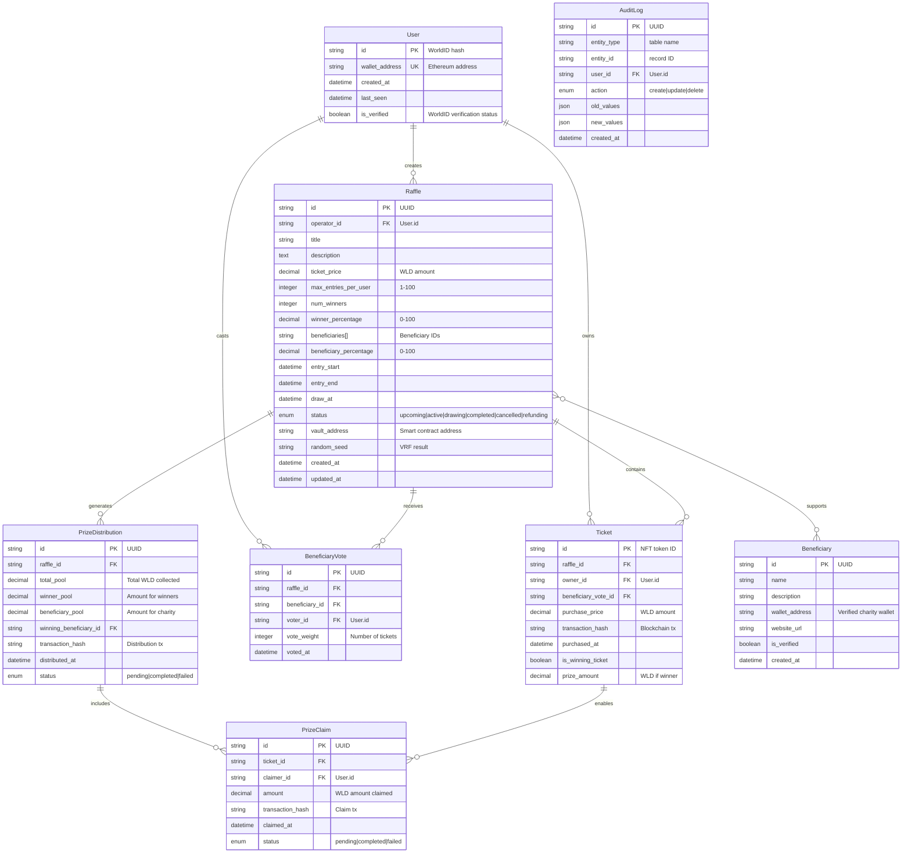
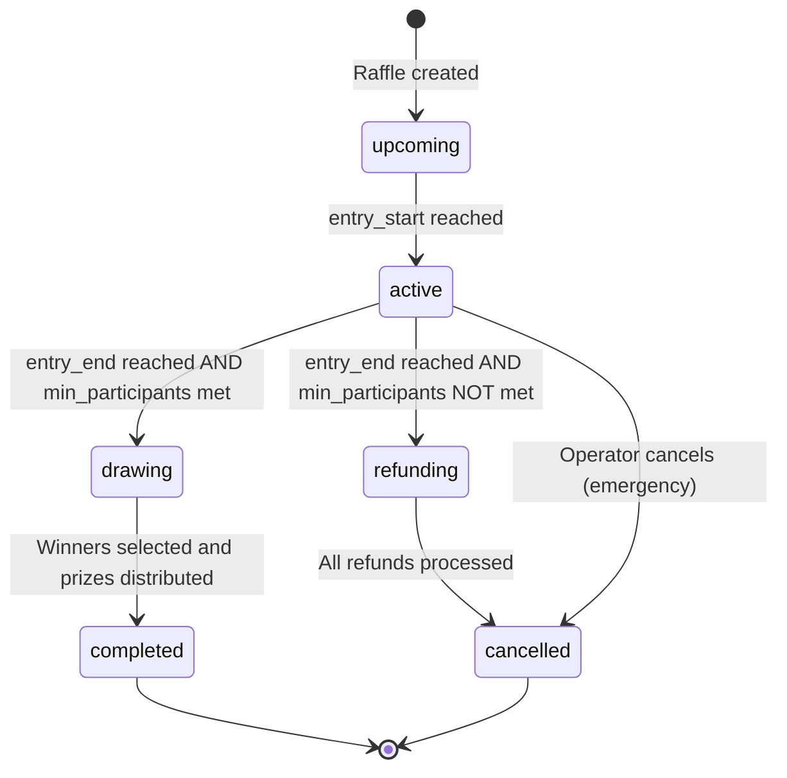

# Data Model: RaffleTime Platform

**Feature**: RaffleTime WorldID-Powered Sweepstakes Platform  
**Date**: 2025-09-08  
**Based on**: Feature specification and research decisions

## Entity Relationship Overview



## Database Schema (PostgreSQL + Prisma)

### Core Tables

#### Users Table
```sql
CREATE TABLE users (
    id VARCHAR(66) PRIMARY KEY, -- WorldID hash
    wallet_address VARCHAR(42) UNIQUE NOT NULL,
    created_at TIMESTAMP WITH TIME ZONE DEFAULT CURRENT_TIMESTAMP,
    last_seen TIMESTAMP WITH TIME ZONE DEFAULT CURRENT_TIMESTAMP,
    is_verified BOOLEAN DEFAULT false
);

CREATE INDEX idx_users_wallet ON users(wallet_address);
CREATE INDEX idx_users_verified ON users(is_verified);
```

#### Raffles Table
```sql
CREATE TYPE raffle_status AS ENUM (
    'upcoming', 'active', 'drawing', 'completed', 'cancelled', 'refunding'
);

CREATE TABLE raffles (
    id UUID PRIMARY KEY DEFAULT gen_random_uuid(),
    operator_id VARCHAR(66) NOT NULL REFERENCES users(id),
    title VARCHAR(255) NOT NULL,
    description TEXT,
    ticket_price DECIMAL(18,4) NOT NULL CHECK (ticket_price >= 0.0001 AND ticket_price <= 1000),
    max_entries_per_user INTEGER NOT NULL CHECK (max_entries_per_user >= 1 AND max_entries_per_user <= 100),
    num_winners INTEGER NOT NULL CHECK (num_winners >= 0),
    winner_percentage DECIMAL(5,2) NOT NULL CHECK (winner_percentage >= 0 AND winner_percentage <= 100),
    beneficiaries UUID[] NOT NULL,
    beneficiary_percentage DECIMAL(5,2) NOT NULL CHECK (beneficiary_percentage >= 0 AND beneficiary_percentage <= 100),
    entry_start TIMESTAMP WITH TIME ZONE NOT NULL,
    entry_end TIMESTAMP WITH TIME ZONE NOT NULL,
    draw_at TIMESTAMP WITH TIME ZONE,
    status raffle_status DEFAULT 'upcoming',
    vault_address VARCHAR(42),
    random_seed VARCHAR(66),
    created_at TIMESTAMP WITH TIME ZONE DEFAULT CURRENT_TIMESTAMP,
    updated_at TIMESTAMP WITH TIME ZONE DEFAULT CURRENT_TIMESTAMP,
    CONSTRAINT valid_percentages CHECK (winner_percentage + beneficiary_percentage = 100),
    CONSTRAINT valid_winners_or_beneficiaries CHECK (num_winners > 0 OR beneficiary_percentage > 0),
    CONSTRAINT valid_dates CHECK (entry_start < entry_end)
);

CREATE INDEX idx_raffles_status ON raffles(status);
CREATE INDEX idx_raffles_operator ON raffles(operator_id);
CREATE INDEX idx_raffles_entry_period ON raffles(entry_start, entry_end);
```

#### Tickets Table
```sql
CREATE TABLE tickets (
    id VARCHAR(78) PRIMARY KEY, -- NFT token ID (uint256 as hex)
    raffle_id UUID NOT NULL REFERENCES raffles(id),
    owner_id VARCHAR(66) NOT NULL REFERENCES users(id),
    beneficiary_vote_id UUID REFERENCES beneficiary_votes(id),
    purchase_price DECIMAL(18,4) NOT NULL,
    transaction_hash VARCHAR(66) NOT NULL,
    purchased_at TIMESTAMP WITH TIME ZONE DEFAULT CURRENT_TIMESTAMP,
    is_winning_ticket BOOLEAN DEFAULT false,
    prize_amount DECIMAL(18,4) DEFAULT 0
);

CREATE INDEX idx_tickets_raffle ON tickets(raffle_id);
CREATE INDEX idx_tickets_owner ON tickets(owner_id);
CREATE INDEX idx_tickets_winner ON tickets(is_winning_ticket) WHERE is_winning_ticket = true;
CREATE UNIQUE INDEX idx_tickets_tx ON tickets(transaction_hash);
```

#### Beneficiaries Table
```sql
CREATE TABLE beneficiaries (
    id UUID PRIMARY KEY DEFAULT gen_random_uuid(),
    name VARCHAR(255) NOT NULL,
    description TEXT,
    wallet_address VARCHAR(42) UNIQUE NOT NULL,
    website_url VARCHAR(500),
    is_verified BOOLEAN DEFAULT false,
    created_at TIMESTAMP WITH TIME ZONE DEFAULT CURRENT_TIMESTAMP
);

CREATE INDEX idx_beneficiaries_verified ON beneficiaries(is_verified);
```

#### Beneficiary Votes Table
```sql
CREATE TABLE beneficiary_votes (
    id UUID PRIMARY KEY DEFAULT gen_random_uuid(),
    raffle_id UUID NOT NULL REFERENCES raffles(id),
    beneficiary_id UUID NOT NULL REFERENCES beneficiaries(id),
    voter_id VARCHAR(66) NOT NULL REFERENCES users(id),
    vote_weight INTEGER DEFAULT 1,
    voted_at TIMESTAMP WITH TIME ZONE DEFAULT CURRENT_TIMESTAMP,
    UNIQUE(raffle_id, voter_id) -- One vote per user per raffle
);

CREATE INDEX idx_beneficiary_votes_raffle ON beneficiary_votes(raffle_id);
CREATE INDEX idx_beneficiary_votes_beneficiary ON beneficiary_votes(beneficiary_id);
```

#### Prize Distributions Table
```sql
CREATE TYPE distribution_status AS ENUM ('pending', 'completed', 'failed');

CREATE TABLE prize_distributions (
    id UUID PRIMARY KEY DEFAULT gen_random_uuid(),
    raffle_id UUID NOT NULL REFERENCES raffles(id),
    total_pool DECIMAL(18,4) NOT NULL,
    winner_pool DECIMAL(18,4) NOT NULL,
    beneficiary_pool DECIMAL(18,4) NOT NULL,
    winning_beneficiary_id UUID REFERENCES beneficiaries(id),
    transaction_hash VARCHAR(66),
    distributed_at TIMESTAMP WITH TIME ZONE DEFAULT CURRENT_TIMESTAMP,
    status distribution_status DEFAULT 'pending'
);

CREATE INDEX idx_prize_distributions_raffle ON prize_distributions(raffle_id);
CREATE INDEX idx_prize_distributions_status ON prize_distributions(status);
```

#### Prize Claims Table
```sql
CREATE TYPE claim_status AS ENUM ('pending', 'completed', 'failed');

CREATE TABLE prize_claims (
    id UUID PRIMARY KEY DEFAULT gen_random_uuid(),
    ticket_id VARCHAR(78) NOT NULL REFERENCES tickets(id),
    claimer_id VARCHAR(66) NOT NULL REFERENCES users(id),
    amount DECIMAL(18,4) NOT NULL,
    transaction_hash VARCHAR(66),
    claimed_at TIMESTAMP WITH TIME ZONE DEFAULT CURRENT_TIMESTAMP,
    status claim_status DEFAULT 'pending'
);

CREATE INDEX idx_prize_claims_ticket ON prize_claims(ticket_id);
CREATE INDEX idx_prize_claims_claimer ON prize_claims(claimer_id);
CREATE INDEX idx_prize_claims_status ON prize_claims(status);
```

#### Audit Log Table
```sql
CREATE TYPE audit_action AS ENUM ('create', 'update', 'delete');

CREATE TABLE audit_logs (
    id UUID PRIMARY KEY DEFAULT gen_random_uuid(),
    entity_type VARCHAR(50) NOT NULL,
    entity_id VARCHAR(78) NOT NULL,
    user_id VARCHAR(66) REFERENCES users(id),
    action audit_action NOT NULL,
    old_values JSONB,
    new_values JSONB,
    created_at TIMESTAMP WITH TIME ZONE DEFAULT CURRENT_TIMESTAMP
);

CREATE INDEX idx_audit_logs_entity ON audit_logs(entity_type, entity_id);
CREATE INDEX idx_audit_logs_user ON audit_logs(user_id);
CREATE INDEX idx_audit_logs_created ON audit_logs(created_at);
```

## State Machine Definitions

### Raffle Lifecycle States


### State Transition Rules
1. **upcoming → active**: Automatic when `entry_start` timestamp reached
2. **active → drawing**: Automatic when `entry_end` reached AND participant count >= minimum
3. **active → refunding**: Automatic when `entry_end` reached AND participant count < minimum  
4. **drawing → completed**: Manual trigger after VRF callback and prize distribution
5. **refunding → cancelled**: Automatic when all tickets refunded
6. **active → cancelled**: Manual operator trigger (emergency only)

### Validation Rules

#### Raffle Creation Validation
- `ticket_price` between 0.0001 and 1000 WLD
- `max_entries_per_user` between 1 and 100
- `winner_percentage + beneficiary_percentage = 100`
- `num_winners > 0 OR beneficiary_percentage > 0`
- `entry_start < entry_end`
- At least one beneficiary specified
- Operator has deposited 10 WLD

#### Ticket Purchase Validation  
- Raffle status must be 'active'
- Current time between `entry_start` and `entry_end`
- User tickets count < `max_entries_per_user` for this raffle
- User has WorldID verification
- Payment amount matches `ticket_price`
- Beneficiary vote required if multiple beneficiaries

#### Prize Distribution Validation
- Raffle status must be 'drawing'
- VRF randomness generated and verified
- All calculations auditable on-chain
- Winner selection algorithm deterministic from seed

## Performance Optimizations

### Database Indexes
- **Composite**: `(raffle_id, owner_id)` on tickets for user participation queries
- **Partial**: `(status)` on raffles WHERE status IN ('active', 'drawing') 
- **GiST**: `(entry_start, entry_end)` on raffles for time range queries
- **Hash**: `(transaction_hash)` on tickets and prize_claims for blockchain sync

### Caching Strategy
- **Redis**: Active raffle list with 30-second TTL
- **Application**: User ticket counts per raffle (invalidate on purchase)
- **CDN**: Beneficiary information and logos (long-lived)

### Query Patterns
```sql
-- Most common: Get active raffles with stats
SELECT r.*, 
       COUNT(t.id) as ticket_count,
       SUM(t.purchase_price) as current_pool
FROM raffles r
LEFT JOIN tickets t ON r.id = t.raffle_id
WHERE r.status = 'active'
GROUP BY r.id
ORDER BY r.entry_end ASC;

-- User dashboard: My tickets and winnings
SELECT r.title, t.id, t.is_winning_ticket, t.prize_amount, pc.status
FROM tickets t
JOIN raffles r ON t.raffle_id = r.id  
LEFT JOIN prize_claims pc ON t.id = pc.ticket_id
WHERE t.owner_id = $1
ORDER BY t.purchased_at DESC;
```

## Migration Strategy

### Phase 1: Schema Creation
1. Create all tables with proper constraints
2. Set up audit triggers for all tables
3. Create initial beneficiary records (Red Cross, Oxfam, UNICEF)
4. Populate with existing mock data for testing

### Phase 2: Smart Contract Integration
1. Add blockchain event listeners
2. Sync existing contract state to database
3. Validate data consistency between on-chain and off-chain
4. Set up monitoring for sync failures

### Phase 3: Real-time Features  
1. Implement PostgreSQL NOTIFY triggers
2. Set up WebSocket event broadcasting
3. Add client-side state management for live updates
4. Performance testing with concurrent users

This data model provides a solid foundation for the RaffleTime platform while maintaining consistency with the existing TypeScript types and smart contract requirements.