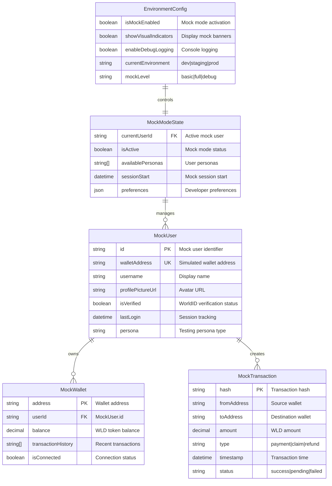

# Data Model: Frontend Mock Mode

**Feature**: Frontend Mock Mode for UI Testing  
**Date**: 2025-09-08  
**Based on**: Feature specification and research decisions

## Entity Overview



## TypeScript Type Definitions

### Core Mock Types

#### MockUser Interface
```typescript
interface MockUser {
  id: string
  walletAddress: string
  username: string | null
  profilePictureUrl: string | null
  isVerified: boolean
  lastLogin: Date
  persona: MockPersona
  metadata: {
    createdAt: Date
    isActive: boolean
    testingNotes?: string
  }
}

type MockPersona = 
  | 'new-user'      // Recently joined, minimal activity
  | 'active-user'   // Regular platform usage
  | 'power-user'    // High engagement, multiple raffles
  | 'vip-user'      // Premium features, high balance
  | 'problem-user'  // Edge cases, error scenarios
```

#### MockWallet Interface
```typescript
interface MockWallet {
  address: string
  userId: string
  balance: string // Decimal string for precision
  transactionHistory: MockTransaction[]
  isConnected: boolean
  network: 'mainnet' | 'testnet' | 'local'
  capabilities: {
    canPay: boolean
    canReceive: boolean
    canSign: boolean
  }
}
```

#### MockTransaction Interface
```typescript
interface MockTransaction {
  hash: string
  fromAddress: string
  toAddress: string
  amount: string // Decimal string
  type: TransactionType
  timestamp: Date
  status: TransactionStatus
  metadata: {
    gasUsed?: string
    blockNumber?: number
    confirmations?: number
  }
}

type TransactionType = 
  | 'payment'     // Ticket purchases
  | 'claim'       // Prize claims
  | 'refund'      // Refund processing
  | 'deposit'     // Operator deposits

type TransactionStatus = 'success' | 'pending' | 'failed'
```

### Configuration Types

#### EnvironmentConfig Interface
```typescript
interface EnvironmentConfig {
  isMockEnabled: boolean
  showVisualIndicators: boolean
  enableDebugLogging: boolean
  currentEnvironment: 'development' | 'staging' | 'production'
  mockLevel: MockLevel
  features: {
    allowUserSwitching: boolean
    simulateNetworkDelay: boolean
    enableErrorScenarios: boolean
  }
}

type MockLevel = 
  | 'basic'       // Simple mock responses
  | 'full'        // Complete simulation with state
  | 'debug'       // Full simulation + detailed logging
```

#### MockModeState Interface
```typescript
interface MockModeState {
  currentUserId: string | null
  isActive: boolean
  availablePersonas: MockPersona[]
  sessionStart: Date
  preferences: MockPreferences
  statistics: {
    interactionsCount: number
    errorsTriggered: number
    sessionDuration: number
  }
}

interface MockPreferences {
  defaultPersona: MockPersona
  autoLogin: boolean
  preserveSession: boolean
  simulateDelay: boolean
  showTransactionDetails: boolean
}
```

## Mock Data Structures

### Predefined Mock Users
```typescript
const mockUserProfiles: Record<MockPersona, MockUser> = {
  'new-user': {
    id: 'mock-new-001',
    walletAddress: '0x1234567890123456789012345678901234567890',
    username: 'NewTester',
    profilePictureUrl: null,
    isVerified: true,
    lastLogin: new Date(),
    persona: 'new-user',
    metadata: {
      createdAt: new Date(),
      isActive: true,
      testingNotes: 'Fresh user for onboarding flow testing'
    }
  },
  'active-user': {
    id: 'mock-active-001',
    walletAddress: '0x2345678901234567890123456789012345678901',
    username: 'ActiveTester',
    profilePictureUrl: '/mock-avatars/active-user.png',
    isVerified: true,
    lastLogin: new Date(),
    persona: 'active-user',
    metadata: {
      createdAt: new Date(Date.now() - 30 * 24 * 60 * 60 * 1000), // 30 days ago
      isActive: true,
      testingNotes: 'Regular user for standard flow testing'
    }
  },
  // Additional personas...
}
```

### Mock MiniKit Responses
```typescript
interface MockMiniKitResponses {
  walletAuth: {
    success: WalletAuthSuccessPayload
    error: WalletAuthErrorPayload
  }
  payment: {
    success: PayCommandSuccessPayload
    insufficient_funds: PayCommandErrorPayload
    user_cancelled: PayCommandErrorPayload
  }
  verify: {
    success: VerifyCommandSuccessPayload
    error: VerifyCommandErrorPayload
  }
}

// Example success response structure
const mockWalletAuthSuccess: WalletAuthSuccessPayload = {
  status: 'success',
  address: '0x1234567890123456789012345678901234567890',
  message: 'Mock wallet authentication successful',
  signature: '0xmocksignature...',
  nonce: 'mock-nonce-123'
}
```

## State Management Architecture

### React Context Structure
```typescript
interface MockModeContextValue {
  // State
  config: EnvironmentConfig
  state: MockModeState
  currentUser: MockUser | null
  
  // Actions
  activateMockMode: () => void
  deactivateMockMode: () => void
  switchUser: (persona: MockPersona) => void
  simulateError: (errorType: string) => void
  resetSession: () => void
  
  // Utilities
  isMockActive: boolean
  getMockResponse: <T>(command: string, scenario?: string) => T
  logMockInteraction: (action: string, data?: any) => void
}
```

### Local Storage Schema
```typescript
interface MockModeStorageData {
  version: string
  sessionId: string
  preferences: MockPreferences
  currentUser: MockUser | null
  sessionStats: {
    startTime: string
    interactions: number
    lastActive: string
  }
}

const STORAGE_KEYS = {
  MOCK_MODE: 'raffletime_mock_mode',
  USER_PREFERENCES: 'raffletime_mock_preferences',
  SESSION_DATA: 'raffletime_mock_session'
} as const
```

## Component Integration Patterns

### Enhanced Component Props
```typescript
// Existing components extended with mock awareness
interface LoginComponentProps {
  onLogin?: (user: User) => void
  onError?: (error: Error) => void
  // Mock mode extensions
  mockConfig?: {
    autoLogin?: boolean
    simulateDelay?: number
    forceError?: boolean
  }
}

interface PayComponentProps {
  amount: string
  recipient: string
  onSuccess?: (txHash: string) => void
  onError?: (error: Error) => void
  // Mock mode extensions
  mockConfig?: {
    simulateNetworkDelay?: boolean
    forceFailure?: boolean
    customTxHash?: string
  }
}
```

### Hook Integration
```typescript
// Custom hook for mock-aware components
interface UseMockModeResult {
  isMockMode: boolean
  mockUser: MockUser | null
  mockWallet: MockWallet | null
  mockActions: {
    switchUser: (persona: MockPersona) => Promise<void>
    simulateTransaction: (type: TransactionType, amount: string) => Promise<MockTransaction>
    triggerError: (scenario: string) => void
  }
}

const useMockMode = (): UseMockModeResult => {
  // Implementation handles environment detection and state management
}
```

## Mock Response Generation

### Dynamic Response Creation
```typescript
class MockResponseGenerator {
  generateWalletAuthResponse(user: MockUser, scenario: 'success' | 'error' = 'success') {
    if (scenario === 'error') {
      return { status: 'error', error_code: 'user_cancelled' }
    }
    
    return {
      status: 'success',
      address: user.walletAddress,
      signature: this.generateMockSignature(),
      nonce: this.generateNonce()
    }
  }
  
  generatePaymentResponse(amount: string, scenario: 'success' | 'insufficient_funds' | 'user_cancelled' = 'success') {
    switch (scenario) {
      case 'success':
        return {
          status: 'success',
          transaction_hash: this.generateTxHash(),
          amount: amount
        }
      case 'insufficient_funds':
        return {
          status: 'error',
          error_code: 'insufficient_funds',
          message: 'Insufficient WLD balance'
        }
      // Additional scenarios...
    }
  }
  
  private generateTxHash(): string {
    return '0x' + Array.from({ length: 64 }, () => 
      Math.floor(Math.random() * 16).toString(16)
    ).join('')
  }
}
```

This data model provides a comprehensive foundation for implementing the frontend mock mode, enabling developers to test UI components and user flows without requiring the actual WorldCoin app environment.